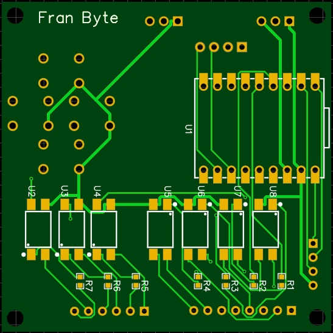

---
# ESP32-S3-MiniController (v2.0)

A compact **motor tester / I/O controller** based on the **ESP32‑S3 SuperMini**, with a **1.3" SH1106 OLED**, four **cursor‑style buttons** (UP/DOWN/LEFT/RIGHT), and **configurable opto‑isolated I/O**.
It provides a clean **on‑device UI** for setting speed, direction, brake, and for managing **stored motor profiles** with persistent settings (NVS). Supports **English/Spanish**, **serial telemetry**, and a **diagnostics** mode.

> **Key idea:** With optocouplers on the I/O lines, you can safely interface **24 V logic** drivers while keeping the ESP32 at **3.3 V**.
> **Important:** If you **swap the optocouplers' orientation**, the **signal direction inverts**—the same ESP32 pin can function as an **output** (driving the opto LED) or an **input** (reading the opto transistor). The firmware lets you **configure that pin's role** accordingly.
---

### **Additional Note about Pull‑Up Resistors**

Pull‑up resistors on the ESP32 side can be **omitted** if they are **enabled in software** (using the internal pull‑ups).  
On the external side, you must verify whether the **external circuit already includes pull‑ups**; if it does not, then **you must add them** to ensure correct signal operation when using optocouplers in input mode.

---

## ✨ Features

- **OLED UI** (SH1106 128×64) with **UP/DOWN** for speed changes, **RIGHT** for menu/select, **LEFT** for back/cancel.
- **Configurable profiles** (name, brake/stop presence, LD/FG support & polarity, PPR, max clock Hz), stored in **NVS**.
- **LEDC clock generation** at **50% duty** with dynamic frequency changes (0…maxClockHz).
- **RPM measurement** from FG pulses (PPR) with 1 s sampling and **FG‑loss safety** (auto reduce to ¼ speed).
- **English / Español** language switching (persisted).
- **Serial telemetry** (optional, persisted).
- **Diagnostics** screen; **boot‑diagnostics** if **UP+DOWN** are held at power‑on.
- Clean **debounce & edge detection** for all four buttons with simple one‑shot events.

---

## 🛠️ Hardware Overview

**Target board:** ESP32‑S3 SuperMini (ESP32‑S3).  
**Display:** 1.3" SH1106 128×64, I²C.  
**Buttons:** UP, DOWN, LEFT, RIGHT (active‑LOW).  
**I/O to driver:** CLOCK (PWM), DIR, optional BRAKE/STOP.  
**Inputs from driver:** FG (tach), LD (alarm/fault), ENABLE (status).

**Pin map (see `Config.h`):**

```cpp
// Motor driver outputs (via optos if 24V logic)
#define PIN_CLOCK   1     // Step/clock output (PWM)
#define PIN_DIR     2     // Direction control
#define PIN_BRAKE   3     // Optional brake signal
#define PIN_STOP    13    // Optional stop signal

// Inputs from motor driver
#define PIN_FG      12    // Tachometer input (interrupt)
#define PIN_LD      11    // Alarm/fault input
#define PIN_ENABLE  8     // Enable status input (read-only)

// OLED I2C
#define PIN_OLED_SDA 9
#define PIN_OLED_SCL 10

// Buttons (active LOW)
#define PIN_BTN_UP    4
#define PIN_BTN_DOWN  7
#define PIN_BTN_LEFT  5
#define PIN_BTN_RIGHT 6

// LEDC clock (PWM)
#define LEDC_CH_CLOCK   0
#define LEDC_TIMER_BITS 8
```

### PCB – Top Side


### PCB – Bottom Side




### Electrical Schematic


### 🔌 About the Optocouplers (Important)

- Each motor‑interface signal can be **opto‑isolated**.
- **If you swap the optocoupler orientation**, the **direction reverses**:
  - **Output mode:** the ESP32 drives the **opto LED** → the **transistor** pulls the remote side (use proper series resistors and respect current limits).
  - **Input mode:** the remote side drives the **opto LED** → the **transistor** pulls the ESP32 side (use pull‑ups; inputs are **active‑LOW** in this project).
- Because of this, **the same ESP32 pin can be configured as input or output** depending on how the optocoupler is installed. The firmware (profiles + pin modes) supports both roles—**just wire and configure consistently**.

> **Safety:** When interfacing 24 V logic or inductive loads, use appropriate resistors, diodes, and isolation distances. Validate with a current‑limited bench supply before connecting a live driver.

---

## 🧩 Firmware Architecture

**Toolchain:** Arduino framework on ESP32‑S3.

**Main modules:**

- `Config.h` – Pins, constants (I²C pins, debounce times, LEDC bits, RPM sample period, debug flags, language enum).
- `Buttons.h` – Poll‑based debounce (50 ms), falling‑edge events, **one‑shot** getters (`upPressed()`, `downPressed()`, `leftPressed()`, `rightPressed()`).
- `Profiles.h` – `MotorProfile` (name, hasBrake/FG/LD/Stop/Enable, polarities, PPR, maxClockHz) + `ProfileStore` (NVS persistence under `"motors"` namespace with `count` and `active` indices).
- `Motor.h` – `MotorRuntime`: LEDC clock control, direction/brake/stop outputs with profile‑driven polarities, ENABLE input reading, FG **ISR** counting, RPM compute & **FG‑loss safety**, telemetry, language persistence (`"sys"` namespace).
- `Strings_EN.h`, `Strings_ES.h` – Localized UI string tables (`struct Strings`).
- `Ui.h` – State‑machine UI for HOME, MENU, SELECT_MOTOR, ADD‑WIZARD, SETTINGS (Language/Telemetry), ABOUT, DIAGNOSTICS.
- `ESP32-S3-MiniController.ino` – Initializes Serial, Wire, buttons, profile store, motor, UI; loads active profile (or defaults), applies it, checks boot‑diagnostics, and runs the main loop.

---

## 🖥️ UI & Controls

- **HOME**
  - Shows **RPM** (if FG present), **Speed (Hz)**, and status lines (**DIR**, optional **BRAKE/ENABLE/LD**).
  - **UP/DOWN:** change target speed (coarse steps).
  - **LEFT:** go to **DIAGNOSTICS** screen.
  - **RIGHT:** open **MENU**.

- **MENU** (dynamic)
  - **Start/Stop**, **Set DIR = CW/CCW**, **Brake ON/OFF** (if present),
  - **Select Motor**, **Add Motor**, **Delete Active** (if any),
  - **Settings**, **About**, **Back**.
  - **UP/DOWN:** navigate options.
  - **LEFT:** return to HOME.
  - **RIGHT:** select/confirm option.

- **Add Motor Wizard**
  - Steps: **Name → Has BRAKE → Has FG → Has LD → LD polarity → Has STOP → STOP polarity → Has ENABLE → ENABLE polarity → PPR → Max CLOCK Hz → Save?**
  - Name editor: rotate characters with UP/DOWN; **END** marker finalizes.
  - **LEFT:** cancel and return to previous screen.
  - **RIGHT:** confirm and advance to next step.
  - On **Save=YES**, profile is stored and made **active**.

- **Settings**
  - **Language:** English / Español (persisted).
  - **Telemetry:** **ON/OFF** (persisted).
  - **UP/DOWN:** navigate.
  - **LEFT:** return to MENU.
  - **RIGHT:** select option.

- **About**: author, version, build date.
  - **LEFT or RIGHT:** return to MENU.

- **Diagnostics**: live button levels, LD status, RPM, clock Hz, direction.
  - **Boot shortcut:** hold **UP+DOWN** at power‑on.
  - **LEFT:** return to HOME.

---

## ⚙️ Motor Control Details

- **Clock generation:** ESP32 **LEDC** on channel **0**, **8‑bit** resolution, **50% duty**. Frequency is re‑attached on the fly (`ledcDetach/Attach`) to minimize artifacts when changing `Hz`.
- **Direction/Brake/Stop:**
  - Pins are updated by `applyOutputs()` honoring each profile's **presence** and **active polarity** flags.
  - **Stop line** is asserted when **not running** (polarity per profile).
- **Enable (Input):**
  - PIN_ENABLE is configured as **INPUT** and reads the enable status from the external motor driver.
  - The firmware monitors this signal but does not control it (read-only).
- **RPM sampling:**
  - FG ISR counts **pulses**, sampled every `RPM_SAMPLE_MS` (default **1000 ms**).
  - `rpm = (pulses * 60) / PPR`.
  - **FG‑loss safety:** if **running** and **clock>0** but **rpm==0**, automatically reduce `targetHz` to **¼ of current** to mitigate stalls or feedback loss.

---

## 📦 Profiles & Persistence (NVS)

- **Profile fields:**  
  `name`, `hasBrake`, `hasFG`, `hasLD`, `ldActiveLow`, `hasStop`, `stopActiveHigh`, `hasEnable`, `enableActiveHigh`, `ppr`, `maxClockHz`.
- **Storage:**
  - Namespace: `"motors"`. Keys: `"count"`, `"active"`, and per‑profile `"m{idx}_..."` keys for all fields.
  - `append()` grows `count`. `remove(idx)` compacts entries and clears the last slot. If `active` goes out of range, it falls back to first (or none).
- **System settings:**
  - Namespace: `"sys"`. Keys: `"tele"` (bool), `"lang"` (uchar).

---

## ⌨️ Buttons & Debounce

- Inputs are **`INPUT_PULLUP`** and **active‑LOW**.
- **50 ms debounce**; **falling‑edge** generates one‑shot events.
- Four buttons: `upPressed()`, `downPressed()`, `leftPressed()`, `rightPressed()`.
- **No long-press functionality** in the UI – all actions are single press.

---

## 🧪 Telemetry

When enabled (Settings → Telemetry), the firmware periodically prints a one‑line snapshot:

    RPM:<rpm> Hz:<currentHz> Target:<targetHz> DIR:<CW|CCW> LD:<ALARM|OK>

Baud rate: **115200**.

---

## 🔧 Build & Flash

- **Requirements**
  - **Arduino IDE** (or **PlatformIO**) with **ESP32 Arduino** core (ESP32‑S3).
  - **Libraries:**
    - **U8g2** by olikraus (for SH1106).
    - **Preferences** (bundled with ESP32 core).
- **Board setup**
  - Select an **ESP32‑S3** target (e.g., ESP32S3 Dev Module / SuperMini variant).
  - 3.3 V I/O. USB Serial at **115200**.
- **Wiring**
  - Connect **OLED I²C** to **SDA=GPIO9**, **SCL=GPIO10** (as in `Config.h`).
  - Buttons to **GPIO4/7/5/6** (UP/DOWN/LEFT/RIGHT) with internal pull‑ups enabled.
  - Motor I/O to GPIOs per pin map.
  - If using **opto‑isolation**, wire orientation according to desired **direction** (see optocoupler note above).
- **Compile & Flash**
  - Open the project, verify, and upload.
  - Open Serial Monitor (115200) to see boot logs and optional telemetry.

---

## 🔌 Wiring Examples (Optocouplers)

> The following are **generic** examples—always check your optocoupler's datasheet (IF, CTR, VCE(sat), isolation voltage), series resistors, and your driver's I/O specs.

- **ESP32 → Driver (OUTPUT via opto)**
  - ESP32 GPIO ── R(series) ──► Opto **LED+**; **LED‑** → GND.
  - Opto **Transistor** on driver side pulls the driver input line (use pull‑up or pull‑down as required by the driver).
  - Configure the firmware pin as **OUTPUT** and set the appropriate **active polarity** in the profile.

- **Driver → ESP32 (INPUT via opto)**
  - Driver output ── R(series) ──► Opto **LED+**; **LED‑** → driver GND.
  - Opto **Transistor** side pulls the ESP32 GPIO to GND (use ESP32 **`INPUT_PULLUP`**).
  - Configure the firmware pin as **INPUT**; in this project **inputs are active‑LOW** by default (e.g., `ldActiveLow = true`).

- **Swapping orientation** flips the direction; the **same ESP32 pin** can thus be **repurposed** by changing how the optocoupler is installed and updating the profile/pin mode.

---

## 📁 Repository Layout

    /src/ESP32-S3-MiniController/
      ESP32-S3-MiniController.ino   // Main setup and loop
      Config.h                      // Pin definitions and constants
      Buttons.h                     // 4-button debounced input handling
      Profiles.h                    // MotorProfile + ProfileStore (NVS)
      Motor.h                       // MotorRuntime: LEDC, RPM, FG ISR, outputs
      Ui.h                          // UI state machine
      Strings_EN.h                  // English strings
      Strings_ES.h                  // Spanish strings

---

## 🧯 Safety Notes

- Working with **24 V logic** and motor drivers can be hazardous.
- Verify **isolation** and **grounds**, use current‑limited supplies for first power‑up, and maintain safe distances/creepage.
- Always test new profiles at **low speeds** and without load before connecting a real motor.
- Ensure you have an **independent emergency stop**.

---

## 📜 License

[](/LICENSE.txt)

---

## 🚀 Quick Start

1.  **Wire the hardware:**
    - OLED to **SDA=GPIO9, SCL=GPIO10**
    - Buttons: UP=GPIO4, DOWN=GPIO7, LEFT=GPIO5, RIGHT=GPIO6
    - Motor driver via optocouplers to defined pins (see pin map above)

2.  **Build & flash:**
    - Open in Arduino IDE
    - Select ESP32-S3 board
    - Compile and upload
    - Open Serial Monitor at **115200 baud**

3.  **First use:**
    - On first boot, **default profile** loads
    - Use **UP/DOWN** to change speed
    - Press **RIGHT** to open menu
    - Select **Start** to run the motor

4.  **Create custom profiles:**
    - **Menu → Add Motor** to create profiles
    - Configure brake, FG, LD, stop signals as needed
    - Set PPR and max clock frequency

5.  **Optocoupler configuration:**
    - If you reverse an optocoupler's orientation, update the profile to treat that line as **input or output** accordingly

---

## 🎮 Button Reference

| Button    | HOME Screen       | MENU Screen    | Other Screens      |
| --------- | ----------------- | -------------- | ------------------ |
| **UP**    | Increase speed    | Navigate up    | Adjust values up   |
| **DOWN**  | Decrease speed    | Navigate down  | Adjust values down |
| **LEFT**  | Go to diagnostics | Return to HOME | Go back/Cancel     |
| **RIGHT** | Open MENU         | Select option  | Confirm/Next       |

---
